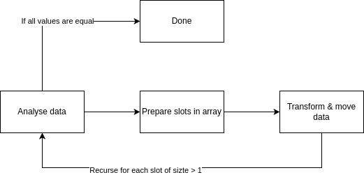

# Algo explanation

The algorithm is close to the [proxmap](https://en.wikipedia.org/wiki/Proxmap_sort) sort. 
The main difference is the approach and the function used to determine the new position of each value. 
The sorting here is though as a referential change. The new value is computed as a sigmoid instead of a simple linear cast to prevent badly distributed values.

It can sort any kind of value as long as it can be translated to double (or float or any other as long as we have addition, subtraction and division defined).



## Step 1: Analyse data
Extract the minimum and the maximum values.

If the delta between the minimum and the maximum value is equal to 0, the remaining values are all equal so we don't need to reorder, so we are done.

## Step 2: Prepare the slots in array
A slot is a logical part of the array where all values collide.

The goal of this step is to prepare the slots to sort the array.
For that, we count the number of collisions we will encounter, to attribute the right sizes to the different slots in the final array.

Example : array = [3, 0, 40, 5], there will typically be 4 slots (as many as the number of values in the array), the first with 3 elements(0, 3 and 5), the two next with 0 and the last with 1 (40).

This will allow us to know where each slot begins in the actual array.
We store those sizes in a dedicated array. 
To know where the value will be sent, we do the operation we will do in the next pass: (nb_slots - 1) * (val - min) / (max - min). With an integer division.
This operation has the desirable property of being fast to compute.

Thus, for [3, 0, 40, 5] we get the slot values of: 

for 3: 3 * (3 - 0) / (40) = 0

for 0: 3 * (0 - 0) / (40) = 0

for 40: 3 * (40 - 0) / (40) = 3

for 5: 3 * (5 - 0) / (40) = 0

## Step 3: Transform & move data

To reduce the risk of collision, before the recursion, the value is transformed using a sigmoid function to modify as much as possible the closest values.
This operation should be as precise as possible, so all division here should use double, or even better precision if available without additional time cost.
The code doing this transformation is 
```
    x = (x - min)/(max - min);
    if (delta > 1) delta = 1/delta;
    double sig = 1/((1 + exp(-x)) * delta);
    return sig;
```
Or even better is to center the points in the function. To achieve that, the goal is to take a value close to most of the points, ignoring the outliers. 
The best value to get is the median, but it is hard to compute. A solution is to take a random value, statistically it is not so bad (as it is used in QuickSort).
The function then becomes 
```
    x = (x - median)/(delta);
    if (delta > 1) delta = 1/delta;
    double sig = 1/((1 + exp(-x)) * delta);
    return sig;
```
Now the sigmoid is centered (more or less) around the median, so if some points are very close and around the middle these will be sent far from one another and far points will be flattened.
This transformation is made for each slot independently as the goal is to improve the result for the recursion, and the recursion will happen in the individual slots.

The transformed value is stored, but the initial value is also kept to avoid rounding issues when doing the transformation and reset the value when we're done.

Once this transformation is done, we proceed to one last pass, placing the values in the corresponding location in each slot.

Then, for each slot with more than one value, we recurse in the specific slot.

## Example on dummy array

```
┌───┐┌───┐┌───┐┌───┐┌───┐┌───┐┌───┐┌───┐┌───┐┌───┐┌───┐┌───┐┌───┐
│ 62││-12││ 15││ 45││  0││ 30││ 25││  3││ 25││ 50││  5││100││ 10│
└───┘└───┘└───┘└───┘└───┘└───┘└───┘└───┘└───┘└───┘└───┘└───┘└───┘
```
First pass => min = -12, max = 100

Second pass =>
```
 -12  -3.4   5.2    13.8   22.4   31.6   40.2    49    57.6   66.2   74.8    83.4  91.4   100
 ┌─────┐┌─────┐┌─────┐┌─────┐┌─────┐┌─────┐┌─────┐┌─────┐┌─────┐┌─────┐┌─────┐┌─────┐┌─────┐
 │  1  ││  3  ││  1  ││  1  ││  3  ││  0  ││    1││    1││    1││    0││    0││    0││    1│
 └─────┘└─────┘└─────┘└─────┘└─────┘└─────┘└─────┘└─────┘└─────┘└─────┘└─────┘└─────┘└─────┘
```
 Then do the sort =>
```
┌───┐┌───┐┌───┐┌───┐┌───┐┌───┐┌───┐┌───┐┌───┐┌───┐┌───┐┌───┐┌───┐
│-12││  0││  3││  5││ 10││ 15││ 30││ 25││ 25││ 45││ 50││ 62││100│
└───┘└───┘└───┘└───┘└───┘└───┘└───┘└───┘└───┘└───┘└───┘└───┘└───┘
```

Then we recurse for the sub arrays of size > 1
```
┌───┐┌───┐┌───┐
│  0││  3││  5│
└───┘└───┘└───┘
┌───┐┌───┐┌───┐
│ 30││ 25││ 25│
└───┘└───┘└───┘
```
Here, both will be sorted fast. The first won't change but the second will need one additional recursion:

```
┌───┐┌───┐┌───┐
│ 30││ 25││ 25│
└───┘└───┘└───┘
```
Min = 25, max = 30 and distribution array:
```
┌───┐┌───┐┌───┐
│  2││  0││  1│
└───┘└───┘└───┘
```
Results:
```
┌───┐┌───┐┌───┐
│ 25││ 25││ 30│
└───┘└───┘└───┘
```
And here the first slot has 2 values identical, so it will recurse but stop after the first pass as min == max

# Memory usage

The following memory usage assumes a number of slots of around O(n).

This algorithm needs memory to store the actual offset in each slot for the next insertion. 
The required quantity for the first version of this algorithm is of O(N) in the worst case, but it probably could be lowered by a smarter way to store the values.


In the context of this proof of concept, with the default parameters given in the code, the memory required will amount to around 8Go.
Here is the breakdown for this value. 
This implementation leverages 5 arrays, for a total of 10 values stored for each value to sort, with each value represented over 8 bytes.
Therefore, 80 bytes are required per value we want to sort, for each value in the default count of 100 million.

# Time complexity

The time complexity of this algorithm is hard to compute as it highly depends on the values and the way these values are represented.
This algorithm has a time complexity a bit hard to compute as it depends on the values, and thus the way those values are represented.
Most of the time, the time complexity is of order of n, if the values create order of n collisions, the complexity may be higher.
To have a time complexity higher than O(n), the values must be in the same slot in a significant way recursively.
If we have values "recursively close" s times, we will have a complexity of O(n * s). 
Depending on the representation of the values, this value may be limited.

To break it down, if we have fixed-length values, the s will be a fixed value. This implies that the time complexity in this usage will be of O(N)

# Parallelism

As this algorithm only focuses on the values, it is completely possible to fully parallelize the process. 
The interaction between the threads will occur in the writing of the extracted values (min and max), the number of values in each slot and in the update of the offset while the sorting occurs.
If the algorithm is highly parallelized, the stability property is lost.

# Big O 

```
                 ┌───────────────────────┐┌────────────────────┐
                 │comparisons            ││swap memory         │
┌───────────────┐├───────┬───────┬───────┤├──────┬──────┬──────┤┌──────┐┌─────────┐┌─────────┐┌─────────┐
│name           ││min    │avg    │max    ││min   │avg   │max   ││stable││partition││adaptive ││compares │
├───────────────┤├───────┼───────┼───────┤├──────┼──────┼──────┤├──────┤├─────────┤├─────────┤├─────────┤
│blitsort       ││n      │n log n│n log n││1     │1     │1     ││yes   ││yes      ││yes      ││yes      │
├───────────────┤├───────┼───────┼───────┤├──────┼──────┼──────┤├──────┤├─────────┤├─────────┤├─────────┤
│crumsort       ││n      │n log n│n log n││1     │1     │1     ││no    ││yes      ││yes      ││yes      │
├───────────────┤├───────┼───────┼───────┤├──────┼──────┼──────┤├──────┤├─────────┤├─────────┤├─────────┤
│fluxsort       ││n      │n log n│n log n││n     │n     │n     ││yes   ││yes      ││yes      ││yes      │
├───────────────┤├───────┼───────┼───────┤├──────┼──────┼──────┤├──────┤├─────────┤├─────────┤├─────────┤
│gridsort       ││n      │n log n│n log n││n     │n     │n     ││yes   ││yes      ││yes      ││yes      │
├───────────────┤├───────┼───────┼───────┤├──────┼──────┼──────┤├──────┤├─────────┤├─────────┤├─────────┤
│quadsort       ││n      │n log n│n log n││1     │n     │n     ││yes   ││no       ││yes      ││yes      │
├───────────────┤├───────┼───────┼───────┤├──────┼──────┼──────┤├──────┤├─────────┤├─────────┤├─────────┤
│wolfsort       ││n      │n log n│n log n││n     │n     │n     ││yes   ││yes      ││yes      ││hybrid   │
├───────────────┤├───────┼───────┼───────┤├──────┼──────┼──────┤├──────┤├─────────┤├─────────┤├─────────┤
│rhsort         ││n      │n log n│n log n││n     │n     │n     ││yes   ││yes      ││semi     ││hybrid   │
├───────────────┤├───────┼───────┼───────┤├──────┼──────┼──────┤├──────┤├─────────┤├─────────┤├─────────┤
│skasort_copy   ││n k    │n k    │n k    ││n     │n     │n     ││yes   ││yes      ││no       ││no       │
├───────────────┤├───────┼───────┼───────┤├──────┼──────┼──────┤├──────┤├─────────┤├─────────┤├─────────┤
│castsort       ││0      │0      │0      ││n     │n     │n^2   ││yes   ││?        ││?        ││no       │
└───────────────┘└───────┴───────┴───────┘└──────┴──────┴──────┘└──────┘└─────────┘└─────────┘└─────────┘

```
It is to know that the worst case has an extremely low probability to occur,
as the distribution of the values would have to be recursively of the same repartition: 
one very far from the others and all others VERY close.

# Benchmark

In progress